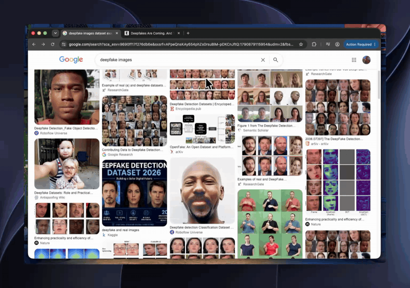
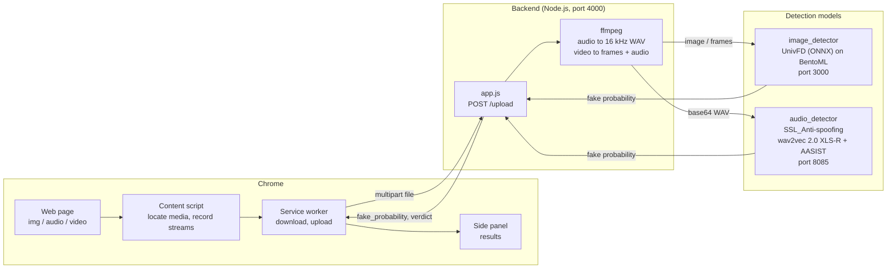

# CM Detector

Detect AI-generated images, synthetic speech, and deepfake videos directly on any web page.
Right-click a piece of media (or hover over it and press a shortcut) and a Chrome side panel
shows the probability that it is fake.

Built for 2024 MChackathon.

## Demo



Full-quality video: [Screen Studio](https://screen.studio/share/vhEvPd1a)

## How it works

1. The Chrome extension gets the media the user selected:
   - Images, audio, and video with a normal URL are downloaded directly.
   - Streamed media (`blob:` URLs, as used by Instagram, X, and YouTube) is recorded from the
     playing element for 6 seconds.
2. The extension uploads the file to the backend (`app.js`).
3. The backend routes it to the detection models:
   - Images go to the image model.
   - Audio is converted to 16 kHz mono WAV and sent to the speech model.
   - Video is split into its audio track (speech model) and 4 evenly spaced frames (image model).
     The final score is the higher of the two.
4. The backend returns a single `fake_probability` between 0 and 1. A value of 0.5 or higher is
   reported as "Likely fake".

## Architecture



| Component | Path | Description |
|---|---|---|
| Chrome extension | `Extensions/cm-detector` | Plasmo + React. Context menu, shortcut, side panel |
| Backend | `app.js` | Express. Converts media with ffmpeg and combines model scores |
| Image model | `image_detector/server_univfd` | [UnivFD](https://github.com/WisconsinAIVision/UniversalFakeDetect) exported to ONNX, served with BentoML |
| Speech model | `audio_detector` | [SSL_Anti-spoofing](https://github.com/TakHemlata/SSL_Anti-spoofing) served with Connexion |

## Running with the real models

### Requirements

- Node.js 20 or later, pnpm, ffmpeg
- Python environment for each model service (see below), or Docker for the speech model
- Model weights (not included in this repository):
  - `univfd_model_20240814.onnx` for the image model
  - `LA_model.pth` (fine-tuned SSL_Anti-spoofing) and `xlsr2_300m.pt`
    ([XLS-R 300M](https://github.com/facebookresearch/fairseq/tree/main/examples/wav2vec/xlsr)) for the speech model

### 1. Image model (port 3000)

Place `univfd_model_20240814.onnx` in `image_detector/server_univfd/`, then:

```bash
cd image_detector/server_univfd
pixi install                     # environment is defined for linux-64
pixi run bentoml serve service:UnivfdService --port 3000
```

### 2. Speech model (port 8085)

Put `LA_model.pth` and `xlsr2_300m.pt` in a folder such as `~/models`, then run it with Docker:

```bash
cd audio_detector
docker build -t cm-audio-detector .
docker run --rm -p 8085:8085 -v ~/models:/models cm-audio-detector
```

Or run it directly in a Python environment with PyTorch installed:

```bash
cd audio_detector
pip install -r requirements.txt
SSL_MODEL_PATH=~/models/LA_model.pth XLSR_PATH=~/models/xlsr2_300m.pt \
  uvicorn --factory swagger_server.__main__:main --port 8085
```

The service returns HTTP 503 if the weights cannot be found.

### 3. Backend (port 4000)

```bash
npm install
node app.js
```

If the model services run elsewhere, set `IMAGE_SERVICE_URL` and `AUDIO_SERVICE_URL`
(defaults: `http://localhost:3000/inference` and `http://localhost:8085/spoof_detector`).

### 4. Chrome extension

```bash
cd Extensions/cm-detector
pnpm install
pnpm build
```

Open `chrome://extensions`, enable Developer mode, choose "Load unpacked", and select
`Extensions/cm-detector/build/chrome-mv3-prod`.

### 5. Use it

- Right-click an image, audio, or video and choose **Check for deepfake**.
- On sites that replace the right-click menu (X, YouTube), hover over the media and press
  **Alt+Shift+D** (Option+Shift+D on macOS). The shortcut can be changed at
  `chrome://extensions/shortcuts`.
- Streamed videos must be playing while they are recorded.

## API

`POST /upload` (multipart form)

| Field | Description |
|---|---|
| `file` | Image, audio, or video file |
| `kind` | Optional: `image`, `audio`, or `video`. Inferred from the file extension if omitted |

Response:

```json
{
  "kind": "video",
  "fake_probability": 0.81,
  "verdict": "fake",
  "details": {
    "audio": { "fake_probability": 0.72, "segment_probabilities": [0.72] },
    "frames": { "fake_probability": 0.81, "frame_probabilities": [0.85, 0.85, 0.7, 0.85] }
  }
}
```

## Limitations

- DRM-protected video (for example Netflix) cannot be recorded.
- Streamed videos are analyzed from a 6-second recording, not the full video.
- Detection history is kept only until the browser is closed (up to 50 entries).
